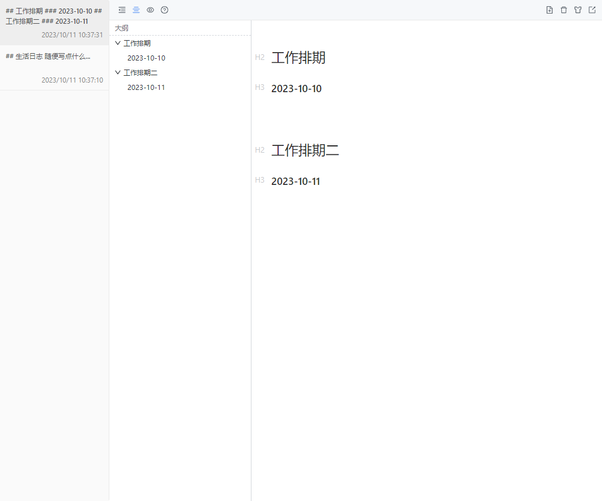

# chrome-extensions-new-tab

Take quick notes in a new tab

---

## 本地安装

1. 下载最新 zip 文件， [https://github.com/liurongqing/chrome-extensions-new-tab/releases](https://github.com/liurongqing/chrome-extensions-new-tab/releases)，然后解压
2. 进入 Chrome 扩展程序页面 chrome://extensions
3. 选择加载已解压的扩展程序按钮，即可使用

Using the [Vditor](https://github.com/Vanessa219/vditor) editor

