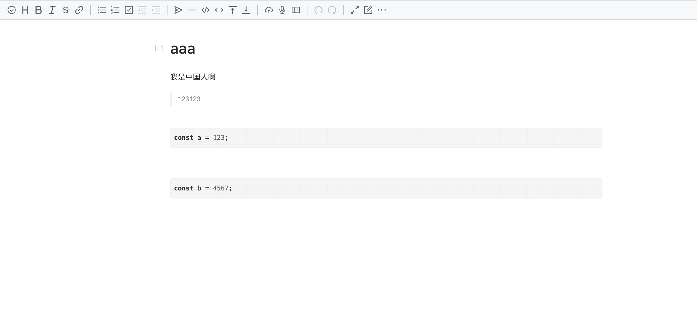

# chrome-extensions-new-tab

Take quick notes in a new tab



---

Using the [Vditor](https://github.com/Vanessa219/vditor) editor


# Todo
1. 左侧未开发完成 
1. 按钮切换未部署
1. ESC切换预览与即时编写
1. 保存内容与时间
1. 默认进来 设置主题
1. 默认预览 - 按哪个键，然后可以编辑 cmd + x 或是 ctrl + x编辑， esc 预览，


在源码中新增一个功能
1. ts/util/Options.ts 文件中 toolbarItem 下添加
```bash
{
    icon: '<svg><use xlink:href="#vditor-icon-delete"></use></svg>',
    name: "delete",
    tipPosition: "nw",
},
```
2. 在 js/icons/ant.js 与 js/icons/material.js 中添加图标
antd svg 图标集 https://github.dev/ant-design/ant-design-icons
```xml
<symbol id="vditor-icon-delete" viewBox="0 0 32 32">
  <path d="M17.167 17.769s0-2.583-1.25-2.667c-1.25-0.167-5.167 0-5.167 0v-8h5.833s-0.083-2.667-1.167-2.667h-9.5l1.583-4.25s-2.333 0.167-3.25 1.667c-0.833 1.5-3.5 9.167-3.5 9.167s0.917 0.417 2.417-0.75c1.5-1.083 2-3.083 2-3.083l2.75-0.167 0.083 8.083s-4.917-0.083-5.833 0c-1 0.083-1.5 2.667-1.5 2.667h7.417s-0.667 4.583-2.5 7.75c-1.917 3.333-5.583 5.917-5.583 5.917s2.583 1.083 5.167-0.417 4.417-8.083 4.417-8.083l5.917 7.417s0.5-3.5-0.083-4.583c-0.667-1-4.167-5-4.167-5l-1.5 1.333 1.083-4.417 6.333 0.083zM18.667 4.269l-0.083 23.999h2.417l0.833 2.917 4.25-2.917h5.917v-23.999h-13.333zM29.333 25.602h-2.75l-3.5 2.667-0.75-2.667h-0.75v-18.582h7.75v18.582z"></path>
</symbol>
```
